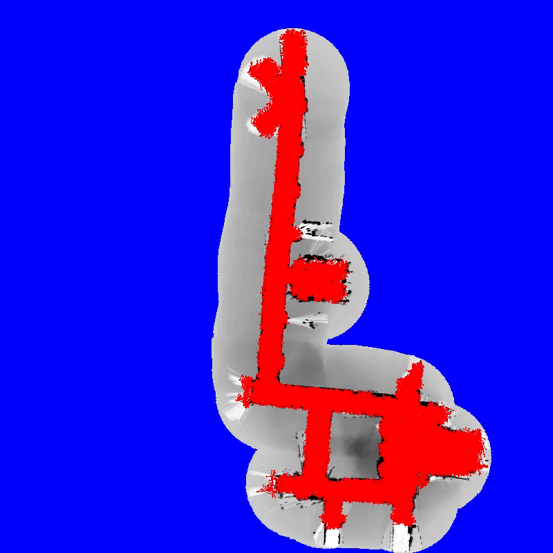

# Dependencies
To run the provided example code, you'll have to install OpenCV. Please follow the instructions provided [here](https://opencv.org/get-started/).

# Building
To build the project, please run the following commands
```
git clone https://github.com/ssharma1991/particle-filter.git
cd particle-filter/
mkdir build
cd build/
cmake .. && cmake --build .
```

To run the provided example,
```
./examples/replay_log
```
You should see a visualization of the particle filter algorithm in action, as seen below.


# Testing
If you make changes to the sorce code, you can run the existing unit tests using
```
GTEST_COLOR=1 ctest --output-on-failure
```